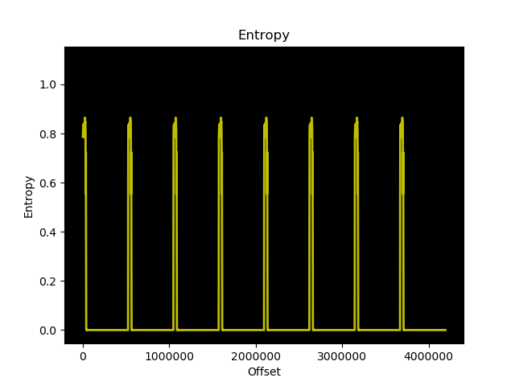

# USB-Capture-Card-Reversing

Making attempts at documenting and reversing cheap chinese USB HDMI capture cards with EEPROM dumps and firmware extraction. 

First dumps uploaded from "USB3.0 Video Capture HDMI 4K" that enumerate as eEver USB Video device, with "No signal V1.8" shown if no video input. However my units do not enable on USB 3.0 even though they have the correct pins connected and all traces connected. 

 ## NOTES
* USB_U9_dump.bin is from my units that do NOT enumerate on USB3, only linking on USB 2.0 High Speed (480MBS), 90% sure it's the configuration for the EJ511 USB 3.0 UVC IC. 
* USB_U6_dump.bin is 100% the MStar MST097B HDMI RX ASIC configuration. 

Binwalk entropy graph U6
 

Binwalk entropy graph U9
 
